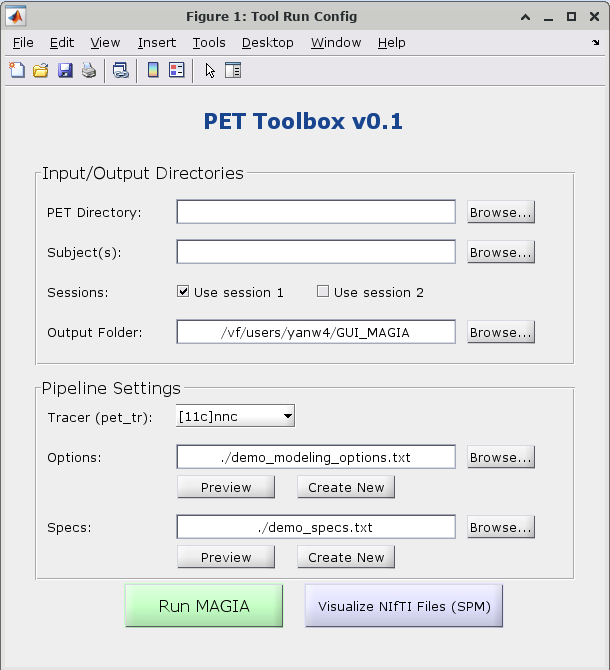

# MAGIA GUI Tutorial

## 1. Introduction
The **MAGIA GUI** provides a user-friendly interface for running PET kinetic modeling with the MAGIA [https://github.com/tkkarjal/magia] pipeline.  
The new version introduces:
- Multi-subject support
- Environment variable customization
- Automatic parameter loading from options/spec files
- Improved error handling and logging

**Prerequisites**
- MATLAB (R2022 or later)
- SPM, FreeSurfer, FSL installed and configured
- Preprocessed PET and MRI data]

---

## 2. Launching the GUI
1. Open MATLAB.
2. Navigate to the MAGIA installation folder.
3. Run:
   ```matlab
   run_magia_gui

## GUI Screenshot


